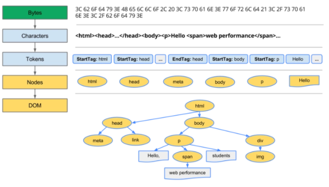
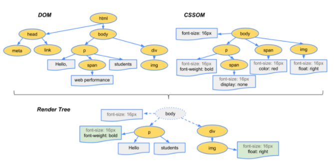
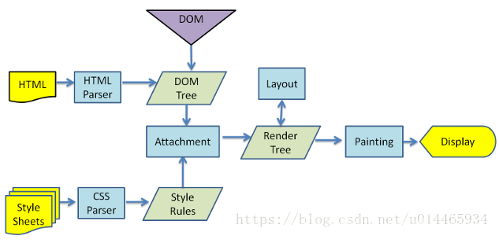

# 浏览器的渲染机制
## 一、DTD 和 DOCTYPE 及他们的作用
- 文档类型定义 $\color{#6cf}{DTD}$ ( document type definition ) 是一系列的语法规则，用来定义 XML 或者 (X)HTML 的文件类型。
- 作用：
   1. 浏览器会根据 DTD 来判断文档类型，决定用何种协议来解析，以及切换浏览器的模式。
   2. DOCTYPE 是用来声明文档类型和 DTD 规范的，一个主要的用途就是便是文件的合法性验证，如果文件代码不合法，浏览器解析时就会出现一些错误。
- 使用：
  - 在 HTML 4.01 中，<!DOCTYPE> 声明引用 DTD，因为 HTML 4.01 基于 $\color{#6cf}{SGML}$ ( Standard Generalized Markup Language，即标准通用标记语言 )。DTD 规定了标记语言的规则，这样浏览器才能正确地呈现内容。
  - HTML5 不基于 $\color{#6cf}{SGML}$ ，所以不需要引用 DTD。
  - `<!DOCTYPE>` 不区分大小写
---
## 二、几个关键概念
1. $\color{#6cf}{DOM}$ ：Document Object Model ，浏览器将 HTML 解析成树形数据结构。
2. $\color{#6cf}{CSSOM}$ ：CSS Object Model ，浏览器将 CSS 代码解析成树形数据结构。
3. DOM 和 CSSOM 都是以 Bytes -> Characters -> Tokens -> Nodes -> Object Model ( 字节 -> 字符 -> 语义块 -> 节点 -> 对应的模型 ) 的过程生成最终的树。

4. $\color{#6cf}{Render}$ $\color{#6cf}{Tree}$ ：DOM 和 CSSOM 合并生成 Render Tree。Render Tree 和 DOM一样，以多叉树的形式保存了每个节点的css属性、节点本身属性、以及节点的孩子节点。如下图：   

---
## 三、浏览器的渲染过程
1. **Create/Update DOM And request css/image/js** ：浏览器请求到 HTML 代码之后，在生成 DOM 的最开始阶段，并发发起 css、图片、js 的请求，无论他们是否在 head 里。
   - 注意：发起 js 文件的下载 request 并不需要 DOM 处理到那个 script 节点。
2. **Create/Update Render CSSOM**：CSS 文件下载完成，开始构建 CSSOM。
3. **Create/Update Render Tree**：所有的 CSS文件下载完成，CSSOM 构建结束后，和 DOM 一起生成 Render Tree。
4. **Layout**：有了 Render Tree，浏览器就知道了页面中有哪些节点、每个节点的 CSS 定义，以及他们的从属关系。下一步的操作就是 Layout，顾名思义就是计算出每个节点在屏幕中的位置。
5. **Painting**：Layout 之后，浏览器知道了哪些节点要显示、每个节点的 CSS 属性是什么、每个节点在屏幕中的位置。就进入最后一步：Painting，按照计算出来的规则，将内容显示在页面上。

---
## 四、重绘 Repaint 与回流 Reflow
1. 定义：
   - 重绘 $\color{#6cf}{Repaint}$：Render Tree 中的一些元素需要更新属性，而这些属性只是影响元素的外观，风格，而不会影响 render 树重新布局的，比如修改字体颜色。
   - 回流 $\color{#6cf}{Reflow}$ : Render Tree 中的一部分或者全部因为元素的规模尺寸、布局、隐藏等改变而需要重新构建。回流的时候，浏览器会使渲染树中受到影响的部分失效，并重新构造这部分渲染树，完成回流后，浏览器会重新绘制受影响的部分到屏幕中，该过程称为重绘。
2. 区别
    - <span style="color:#6cf">回流必将引起重绘，而重绘不一定会引起回流</span>。比如：只有颜色改变的时候就只会发生重绘而不会引起回流。
    - 当页面布局和几何属性改变时就需要回流，比如：添加或者删除可见的DOM元素，元素位置改变，元素尺寸改变——边距、填充、边框、宽度和高度，内容改变。
3. 触发
   - repaint 的触发：
      - 不可见到可见（visibility 样式属性）；
      - 颜色或图片的变化（background, border-color, color 样式属性；
      - text-aligin, a:hover 也会造成重绘；
      - 伪类引起的颜色变化不会导致页面回流，仅仅会触发重绘，不改变页面元素大小，形状和位置，但改变其外观。
   - reflow 的触发：
      - 浏览器窗口的变化；
      - DOM节点的添加和删除操作；
      - 一些改变页面元素的大小，形状，位置的操作会触发；
      - DOM元素测量属性和方法也会触发reflow
4. 减少重绘与回流
   - 将多次改变样式属性的操作合成一次为操作：不要一条一条的修改 DOM 的样式。可以预先定义好 css 的 class，然后将样式都写入其中，然后修改 DOM 中的 className。
      ```javascript
      // 不好的写法
      var left = 10, top = 10;
      el.style.left = left + 'px';
      el.style.top = top + 'px';
      el.style.background = '#6cf';
      // 优化
      el.className += 'theclassname'
      ```
   - 对于要操作的元素，处理完成之后再进行更新
      - 使用 DocumentFragment 进行缓存操作，引发一次回流和重绘；
      - 使用 display:none，只引发两次回流和重绘；
         - 原理：由于 display 属性为 none 的元素不在 Render Tree 中，对这个元素进行操作不会引起其他元素的重排（回流）。
      - 使用 cloneNode() 和 replaceChild() 方法，引起一次回流和重绘。
         ```javascript
         // 将原始元素拷贝到一个脱离文档的节点中,修改副本,完成后再替换回去；
         var old = document.getElementById('list');
         var clone = old.cloneNode(true);
         appendDataToElement(clone, data);
         old.parentNode.replaceChild(clone, old);
         ```
   -  将需要多次重排的元素，position 属性设为 absolute 或 fixed，这样此元素就脱离了文档流，它的变化不会影响到其他元素为动画的 HTML 元素，例如动画，那么修改他们的 CSS 是会大大减小 reflow 。因为,它们不影响其他元素的布局，所它他们只会导致重新绘制，而不是一个完整回流。这样消耗会更低。
   -  不要用 tables 布局的一个原因就是 tables 中某个元素一旦触发 reflow 就会导致 table 里所有的其它元素 reflow。在适合用table 的场合，可以设置 table-layout 为 auto 或 fixed，这样可以让 table 一行一行的渲染，这种做法也是为了限制 reflow 的影响范围。
---
## 五、dispaly:none 和 visibility:hidden
- $\color{#6cf}{dispaly:none}$ 设置该属性后，该元素下的元素都会隐藏，占据的空间消失。
- $\color{#6cf}{visibility:hidden}$ 设置该属性后，元素虽然不可见了，但是依然占据空间的位置。
- display:none 会引起回流(重排)和重绘而visibility:hidden 只会会引起重绘