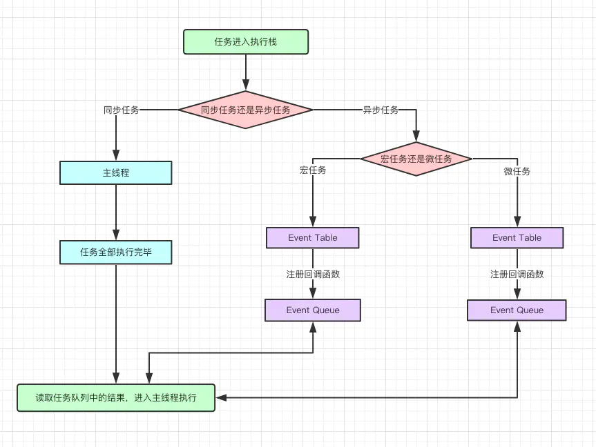
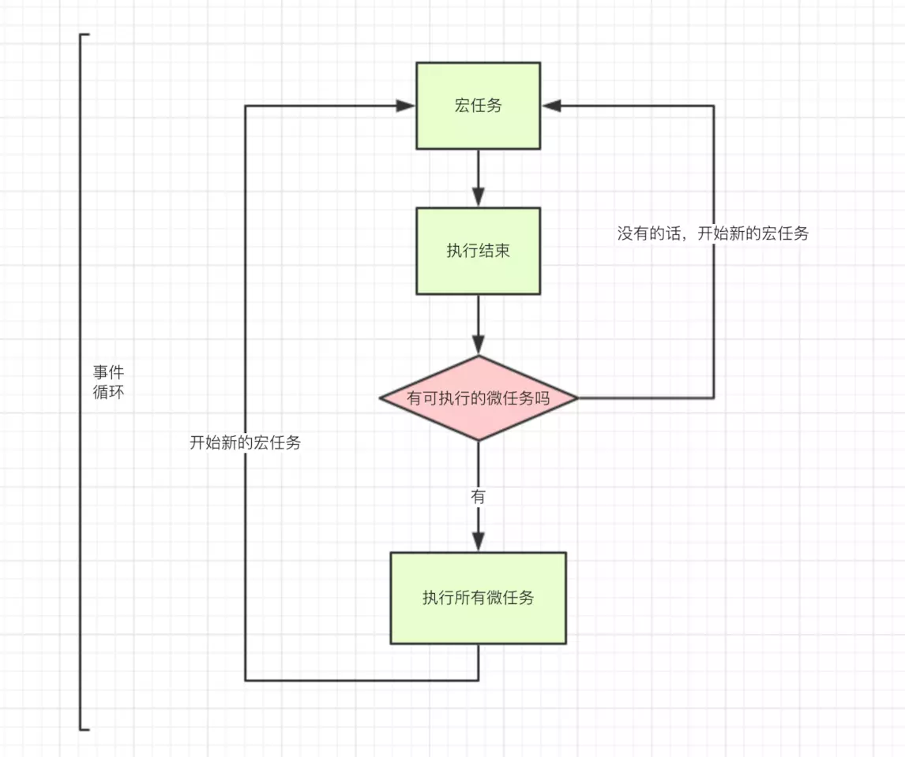

# JS 运行机制
### 一、为什么 JavaScript 是单线程？
JavaScript 语言的一大特点就是 单线程，也就是说同一时间只能做一件事。那么为什么 JavaScript 不能有多个线程呢？    
原因：
1. JavaScript 是单线程能够提高效率。
2. JavaScript 的单线程，与它的用途有关。作为浏览器脚本语言，JavaScript 的主要用途是 与用户互动，以及操作 DOM 。这就决定了它只能是单线程，否则会带来复杂的同步问题。
3. 比如，假定 JavaScript 同时有两个线程，一个线程在某个节点上添加内容，另一个节点删除了这个节点，这个时候应该以哪个线程为准？
4. 因此，为了避免复杂性，从一诞生， JavaScript 就是单线程，这是这门语言的核心特征，将来也不会变。   

！补充：为了利用多核 CPU 的计算能力， HTML5 提出了 Web Worker 标准，允许 JavaScript 脚本创建多个线程，但是 子线程完全受主线程控制，且不能操作 DOM。 所以这个新标准并没有改变 JavaScript 单线程的本质。

---
### 二、JavaScript 为什么是异步？
1. 单线程就意味着，所有任务需要排队，前一个任务结束，才会执行后一个任务。如果前一个任务耗时很长，后一个任务就不得不一直等着。
2. 如果排队是因为计算量大，CPU忙不过来，倒也算了，但是很多时候CPU是闲着的，因为IO设备（输入输出设备）很慢（比如Ajax操作从网络读取数据），不得不等着结果出来，再往下执行。
3. JavaScript语言的设计者意识到，这时主线程完全可以不管IO设备，挂起处于等待中的任务，先运行排在后面的任务。等到IO设备返回了结果，再回过头，把挂起的任务继续执行下去。   

<b>！！！</b>于是 JavaScript 就需要异步执行。

---
### 三、任务队列
1）所有的任务分为两类：    
1. 同步任务（$\color{#6cf}{synchronous}$）：同步任务是指，在主线程上排队执行的任务，只有前一个任务执行完毕后，才能执行后一个任务
2. 异步任务（$\color{#6cf}{asynchronous}$）：异步任务是指不进入主线程，而进入任务队列（$\color{#6cf}{task}$ $\color{#6cf}{queue}$）的任务，只有“任务队列”通知主线程，某个异步任务可以执行了，该任务才会进入主线程执行。
   - 宏任务（$\color{#6cf}{macrotask}$）和微任务（$\color{#6cf}{microtask }$）表示异步任务的两种分类。
   - 宏任务(macro-task)：整体代码script、setTimeOut、setInterval
   - 微任务(mincro-task)：promise.then catch  、process.nextTick(node)
   - 注意：$\color{#6cf}{new}$ $\color{#6cf}{Promise}$ 是会直接进入到主线程立刻执行的，而 $\color{#6cf}{Promise.then}$  则属于微任务！！！

2）异步执行的运行机制如下：    
1. 所有同步任务都在主线程上执行，形成一个执行栈。
2. 主线程之外，还存在一个“任务队列”（$\color{#6cf}{task}$ $\color{#6cf}{queue}$）。只要异步任务有了运行结果，就在“任务队列”中放置一个事件。
3. 一旦“执行栈”中的所有同步任务执行完毕，系统就会读取“任务队列”，看看里面有哪些事件。那些对应的异步任务，于是结束等待状态，进入执行栈，开始执行。
4. 主线程不断重复上面的三步。

---
### 四、事件循环（event loop）
主线程从"任务队列"中读取事件，这个过程是循环不断的，所以整个的这种运行机制又称为Event Loop（事件循环）。

宏任务与微任务的关系：

1. 整体的 script （作为第一个宏任务）开始执行的时候，会把所有代码分为两个部分：“同步任务”、“异步任务”；
2. 同步任务会直接进入主线程依次执行；
3. 异步任务会再划分为宏任务和微任务；
4. 宏任务进入到 Event Table中，并在里面注册回调函数，每当指定的事件完成时，Event Table 会将这个函数转移到 Event Queue 中；
5. 微任务也会进入到另一个 Event Table 中，并在里面注册回调函数，每当指定的事件完成时，Event Table 会将这个函数移到 Event Queue 中；
6. 当主线程内的任务执行完毕，主线程为空时，会检查微任务的 Event Queue，如果有任务就全部执行，如果没有就执行下一个宏任务；
7. 上述过程会不断重复，这就是 Event Loop 事件循环。

---
### 五、定时器
1. 除了放置异步任务的事件，"任务队列"还可以放置定时事件，即指定某些代码在多少时间之后执行。   
2. 这叫做"定时器"（timer）功能，也就是定时执行的代码。    
3. 定时器功能主要由setTimeout()和setInterval()这两个函数来完成，它们的内部运行机制完全一样，区别在于前者指定的代码是一次性执行，后者则为反复执行。    
4. 以下主要讨论setTimeout()。setTimeout()接受两个参数，第一个是回调函数，第二个是推迟执行的毫秒数。
5. HTML5标准规定了setTimeout()的第二个参数的最小值（最短间隔），不得低于4毫秒，如果低于这个值，就会自动增加。在此之前，老版本的浏览器都将最短间隔设为10毫秒。另外，对于那些DOM的变动（尤其是涉及页面重新渲染的部分），通常不会立即执行，而是每16毫秒执行一次。这时使用requestAnimationFrame()的效果要好于setTimeout()。
6. 需要注意的是，setTimeout()只是将事件插入了"任务队列"，必须等到当前代码（执行栈）执行完，主线程才会去执行它指定的回调函数。要是当前代码耗时很长，有可能要等很久，所以并没有办法保证，回调函数一定会在setTimeout()指定的时间执行。