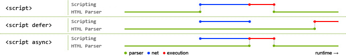
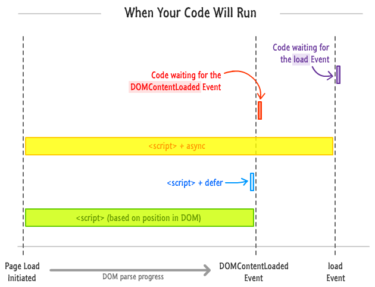

# 异步加载
### 一、异步加载的方式
1. 动态脚本创建
2. async 和 defer
---
### 二、动态脚本创建
在还没有定义 defer 和 async 之前，异步加载是动态创建 script，通过 window.onload 方法确保页面加载完毕再讲 script 标签插入 DOM 中，具体代码如下:
```javascript
function addScript(src) {
  var script = document.createElement('script');
  script.setAttribute("type","text/javascript");
  script.src = src;
  document.body.appendChild(script);
}
window.onload = funtion() {
  addScript("js/index.js");
}
```
---
### 三、 async 和 defer
1. async 方式
   - async 是在脚本加载完之后立即执行。
   - 如果是多个，执行顺序和加载顺序无关。
   - async 会在 load 事件之前执行，但并不能确保与 DOMContentLoaded 的执行先后顺序。
2. defer 方式
   - defer 是在 HTML 解析完之后才会执行。
   - 如果是多个，按照加载的顺序依次执行。
   - defer 脚本会在 DOMContentLoaded 和 load 事件之前执行。

下面两张图可以更清楚地阐述 defer 和 async 的执行以及和 DOMContentLoaded、load 事件的关系：



