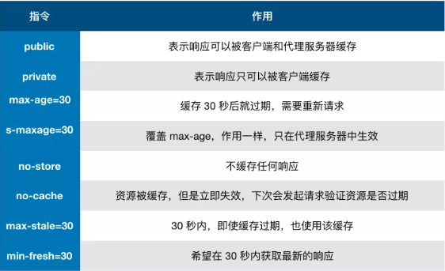
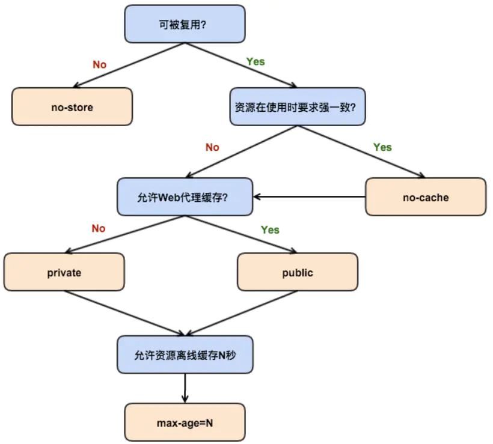

# 浏览器的缓存机制

## 一、浏览器缓存的作用
1. 缓存是 性能优化 中简单高效的一种优化方式。
2. 一个优秀的缓存策略可以缩短网页请求资源的距离，减少延迟。
3. 由于缓存文件可以重复利用，还可以减少带宽，降低网络负荷。   

- 对于一个数据请求，可以分为发起网络请求、后端处理、浏览器响应三个步骤。浏览器缓存可以帮助我们在第一步和第三步骤中优化性能。
- 比如直接使用缓存而不发起请求，或者发起了请求但后端存储的数据与前端一致，那就没必要再将数据传回来，这样就减少了响应数据。
---
## 二、缓存位置
从缓存位置上来说分为四种，并且各自有优先级，当一次查找缓存且都没有命中时，才会去请求网络。
- $\color{#6cf}{Service}$ $\color{#6cf}{Worker}$
- $\color{#6cf}{Memory}$ $\color{#6cf}{Cache}$
- $\color{#6cf}{Disk}$ $\color{#6cf}{Cache}$
- $\color{#6cf}{Push}$ $\color{#6cf}{Cache}$
### (1) Service Worker
- Service Worker 是运行在浏览器背后的独立线程，一般可以用来实现缓存功能。
- 使用 Service Worker 的话，传输协议必须是 HTTPS。因为 Service Worker 中涉及到请求拦截，所以必须使用 HTTPS 协议来保障安全。
- ！！！**Service Worker 的缓存与浏览器其他内建的缓存机制不同，它可以让我们自由控制缓存哪些文件、如何匹配缓存、如何读取缓存，并且缓存是持续的**
- Service Worker 实现缓存功能的步骤：
   1. 注册 Service Worker ，
   2. 监听 install 事件以后就可以缓存需要的文件
   3. 在下次用户访问的时候就可以通过拦截请求的方式查询是否存在缓存
   4. 存在的话就直接读取缓存文件，否则就去请求数据。
   5. 当 Service Worker 没有命中缓存时，我们需要调用 $\color{#6cf}{fetch}$ 函数获取数据。也就是说，会根据缓存查找优先级去查找数据。
   6. 但是不管我们是从 Memory Cache 中还是从网络请求中获取的数据，浏览器都会显示我们是从 Service Worker 中获取的内容。
### (2) Memory Cache
Memory Cache 也就是内存中的缓存，主要包含的是当前页面中已经抓取到的资源，例如页面上已经下载的样式、脚本、图片等。
- 优点：数据读取高效；
- 缺点：
  1. 缓存持续性短，会随着进程的释放而释放。一旦我们关闭了 Tab 页面，内存中的缓存也就被释放了。
  2. 内存的容量小。
- ！！！需要注意的是：**内存缓存存在缓存资源时并不关心返回资源的 HTTP 缓存同 Cache-Control 是什么值，同时资源的匹配也并非仅仅是对 URL 做匹配，还可能读 Content-type，CORS等其他特征做校验**
### (3) Disk Cache
Disk Cache 也就是存储在磁盘上的缓存。
- 优点：容量大，存储时限长；
- 缺点：访问速度比 Memory Cache 慢。
### (4) Push Cache
Push Cache（推送缓存）是 HTTP/2 中的内容，当以上三种缓存都没有命中时，**它才会被使用。它只在会话（Session）中存在，一旦会话结束就被释放**，并且缓存时间也很短暂，在Chrome浏览器中只有5分钟左右，同时它也并非严格执行HTTP头中的缓存指令。   

Push Cache的特点：
1. 所有的资源都可以被推送，并且能够缓存。
2. 可以推送 no-cache 和 no-store 的资源。
3. 一旦连接被关闭， Push Cache 就被释放。
4. 多个页面可以使用同一个 HTTP/2 的连接，也就可以使用同一个 Push Cache。这主要还是依赖浏览器的实现而定，处于对性能的考虑，有的浏览器会对相同域名当时不同的 Tab 标签使用同一个 HTTP 连接。
5. Push Cache 中的缓存只能被使用一次？
6. 浏览器可以接受已经存在的资源推送。
7. 你可以给其他域名推送资源。
---
## 三、缓存过程分析
- 疑问：浏览器怎么确定一个资源该不该缓存，如何去缓存呢？
  - 浏览器第一次向服务器发起请求拿到请求结果后，将 请求结果 和 缓存标识 存入浏览器缓存，**浏览器对缓存的处理是根据第一次请求资源时返回的响应头来确定的**。

- 结论：
   1. 浏览器每次发送请求，都会先在浏览器缓存中查找该请求的结果以及缓存标识。
   2. 浏览器每次拿到返回的请求结果，都会将该结果和缓存标识存入浏览器缓存中。
---
## 四、强缓存
强缓存：不会向服务器发送请求，直接从缓存中读取资源。    
表现：在 chrome 控制台的 Network 选项中可以看到该请求返回 200 的状态码，并且 Size 显示 from disk cache 或者 from memory cache。    
设置：强缓存可以通过设置两种 HTTP Header 实现：$\color{#6cf}{Expires}$ 和 $\color{#6cf}{Cache-Control}$ 。  
1. Expires
   - 缓存过期时间，用来指定资源到期的时间，是 **服务端** 的具体时间。
   - Expires 是 Web 服务器响应消息头字段，在响应 http 请求时告诉浏览器在过期时间前浏览器都可以直接从浏览器缓存读取数据，而无需再次请求。 
   - Expires 是 HTTP/1 的产物，受限于本地时间，如果修改了本地时间，可能会造成缓存的失效。
   - 一个🌰：`Expires: Wed, 22 Oct 2018 08:41:00 GMT+0800` 表示资源会在 "2018/10/22 上午8:41:00(中国标准时间)" 后失效，需要再次请求。

2. Cache-Control
   - 在HTTP/1.1中， Cache-Control 是最重要的规则，主要用于控制网页缓存。
   - Cache-Control 可以在请求头或者响应头中设置，并且可以组合使用多种指令：
     - $\color{#6cf}{pubilc}$：**所有内容都将被缓存(客户端和代理服务器都可以缓存)**。 具体来说响应可被任何中间节点缓存，如 Browser <-- proxy1 <-- proxy2 <-- Server ， 中间的 proxy 可以缓存资源，比如下次再请求同一资源时， proxy1 直接把自己缓存的东西给 Browser 而不是再向 proxy2 要。
     - $\color{#6cf}{private}$：**所有内容只有客户端可以缓存**，Cache-Control 的默认取值。
     - $\color{#6cf}{no-cache}$：客户端缓存内容，是否使用缓存则需要经过协商缓存来验证决定。表示不使用 Cache-Control 的缓存控制方式做前置验证，而是使用 Etag 或者 Last-Modified 字段来控制缓存。**！！！需要注意的是：设置了 no-cache 之后，并不是说浏览器就不再缓存数据，只是浏览器在使用缓存数据时，需要先确认一下数据是否还跟服务器保持一致**。
     - $\color{#6cf}{no-store}$：表示所有内容都不会缓存，即不使用强制缓存，也不使用协商缓存。
     - $\color{#6cf}{max-age}$：max-age=xxx(s)，表示缓存内容将在 xxx 秒后失效。
     - $\color{#6cf}{s-maxage}$：(单位为 s )，同 max-age 作用一样，只在代理服务器生效（比如 CDN 缓存，当 s-maxage=60 时，在这60秒中，即使更新了 CDN 的内容，浏览器也不会进行请求）。max-age 用于普通缓存，而 s-maxage 用于代理缓存。**s-maxage 的优先级高于 max-age**。
     - $\color{#6cf}{max-stale}$：**能容忍的最大过期时间**。max-stale 指令标示了客户端愿意接受一个已经过期了的响应。如果指定了 max-stale 的值，则最大容忍时间为对应的秒数。如果没有指定，那么说明浏览器愿意接收任何 age 的响应（age 表示响应有源站生成或确认的时间与当前时间的差值）。
     - $\color{#6cf}{min-fresh}$：**能够容忍的最小新鲜度**。min-fresh 标示了客户端不愿意接受新鲜度不多于当前 age 加上 min-fresh 设定的时间之和的响应。
  
    
3. Expires 和 Cache-Control 二者的区别   
区别就在于 Expires 是 HTTP1.0 的产物，而 Cache-Control 是 HTTP1.1 的产物，**二者同时 存在的话， Cache-Control 的优先级高于 Expires**，在某些不支持 HTTP1.1 的环境下，Expires 就会发挥用处。
---
## 五、协商缓存
协商缓存就是强缓存失效后，浏览器携带标识向服务器发起请求，由服务器根据缓存标识决定是否使用缓存的过程，主要有以下两种情况：
- 协商缓存生效，返回 304 和 Not Modified

- 协商缓存失效，返回 200 和 请求结果   

协商缓存可以通过设置两种 HTTP Header 来实现：Last-Modified 和 Etag。
1. $\color{#6cf}{Last-Modified}$ 和 $\color{#6cf}{If-Modified-Since}$
   - 浏览器在第一次访问资源时，服务器返回资源的同时，在 response header 中添加 Last-Modified 的 header，值是这个资源在服务器上最后的修改时间，浏览器接收后缓存文件和 header ；
   - 浏览器下次请求这个资源，浏览器就会检测到有 Last-Modified 这个 header，于是添加 If-Modified-Since 这个 header，值就是 Last-Modified 中的值；
   - 服务器再次接收到这个资源请求，会根据 If-Modified-Since 中的值与服务器中的这个资源的最后修改时间进行对比；
   - 如果没有变化，返回 304 和空的响应体，浏览器就直接从缓存中读取资源；
   - 如果 If-Modified-Since 的时间小于服务器中这个资源的最后修改时间，说明文件有更新，于是返回新的资源文件和 200。 
   - Last-Modified 存在的弊端：（1）如果本地打开缓存文件，即使没有对文件进行修改，但还是会造成 Last-Modified 被修改，服务端不能命中缓存导致发送相同的资源。（2） 因为 Last-Modified 只能以秒计时，如果在不可感知的时间内修改完成文件，那么服务端会以为资源被命中了，不会返回正确的资源。
  

2.  $\color{#6cf}{ETag}$ 和 $\color{#6cf}{If-None-Match}$  
   - **ETag 是服务器响应请求时，返回当前资源文件的一个唯一标识(由服务器生成)，只要资源发生了改变，ETag 就会重新生成**；
   - 浏览器在下次加载资源向服务器发送请求是，会将上一次返回的 ETag 值放到 request header 里的 If-None-Match 里；
   - 服务器只需要比较客户端传来的 If-None-Match 跟自己服务器上该资源的 ETag 是否一致，就能很好的判断资源相对客户端而言是否被修改过了。
   - 如果服务器发现 ETag 匹配不上，那么直接以常规 GET 200 回包形式将新的资源(包含新的 ETag )发送给客户端；
   - 如果发现 ETag 是一致的，则直接返回 304 告诉客户端直接使用本地缓存即可。

3. $\color{#6cf}{Last-Modified}$ 和 $\color{#6cf}{ETag }$ 的区别
   - 在精确度上， ETag 要优于 Last-Modified。
   - 在性能上，ETag 要逊于 Last-Modified，毕竟 Last-Modified 只需要记录时间，而 ETag 需要服务器通过算法来计算出一个hash值。
   - 在优先级上，服务器校验优先考虑 ETag。

---
六、缓存机制
- 强缓存机制优先于协商缓存进行；
- 若强制缓存（Expires 和 Cache-Control）生效直接使用缓存；
- 若不生效则进行协商缓存（Last-Modified 和 ETag），协商缓存由服务器决定是否使用缓存；
- 若缓存失效，那么代表该请求的缓存失效，返回 200，重新返回资源和缓存标识，再存入浏览器缓存中；
- 若生效，则返回 304，浏览器继续使用缓存。

---
## 七、实际场景应用缓存策略
1. 频繁变动的资源   
  `Cache-Control:no-cache`   
对于频繁变动的资源，首先需要使用 Cache-Control: no-cache 使浏览器每次都请求服务器，然后配合 ETag 或者 Last-Modified 来验证资源是否有效。这样的做法虽然不能节省请求数量，但是能显著减少响应数据大小。

2. 不常变化的资源  
  `Cache-Control:max-age=31536000`     
  通常在处理这类资源时，给它们的 Cache-Control 配置一个很大的 max-age=31536000 (一年)，这样浏览器之后请求相同的 URL 会命中强制缓存。而为了解决更新的问题，就需要在文件名(或者路径)中添加 hash， 版本号等动态字符，之后更改动态字符，从而达到更改引用 URL 的目的，让之前的强制缓存失效 (其实并未立即失效，只是不再使用了而已)。     
  在线提供的类库 (如 jquery-3.3.1.min.js, lodash.min.js 等) 均采用这个模式。
---
## 八、用户行为对浏览器缓存的影响
- 打开网页，地址栏输入地址： 查找 disk cache 中是否有匹配。如有则使用；如没有则发送网络请求。
- 普通刷新 (F5)：因为 TAB 并没有关闭，因此 memory cache 是可用的，会被优先使用(如果匹配的话)。其次才是 disk cache。
- 强制刷新 (Ctrl + F5)：浏览器不使用缓存，因此发送的请求头部均带有 Cache-control: no-cache(为了兼容，还带了 Pragma: no-cache),服务器直接返回 200 和最新内容。