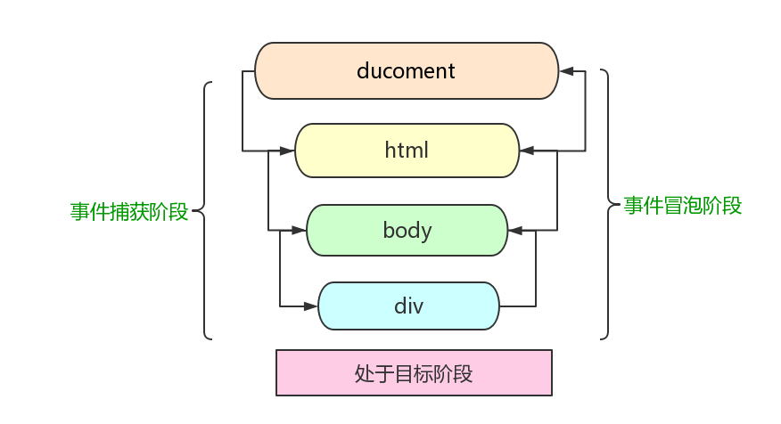

# DOM事件
### 一、事件级别
1. DOM0：element.onclick = function(){}     
  - 通过JS获取到了该元素，并将一个函数赋值给了一个事件处理属性onclick
  - 解绑事件： element.onclick = null;
  - 缺点在于一个处理程序无法同时绑定多个处理函数
2. DOM2：element.addEventListener('click', function(){}, false)
  - 三个参数：
    - 要处理的事件方式
    - 事件处理的函数，可以为匿名函数，也可以为命名函数（但如果需要删除事件，必须是命名函数）
    - 一个布尔值，true：表示在捕获阶段调用事件处理程序；false:表示在冒泡阶段调用事件处理程序
  - 解绑事件：element.removeEventListener('click', function(){}, false)
  - 缺点就是 IE8 以下不兼容，需要使用 attachEvent 来绑定事件， detachEvent 来解绑事件，并且只能支持冒泡类型事件。
3. DOM3：element.addEventListener('keyup', function(){}, false)
  - 相较于 DOM2 ，增加了一些事件类型。
  - 另外还允许用户自定义事件。
---
### 二、事件模型和事件流 
1. DOM事件模型包括捕获和冒泡。
  - 事件捕获的流程为：window -> document -> html -> body -> ... -> 目标元素
  - 事件冒泡的流程为：目标元素 -> ... -> body -> html -> document -> window

2. 事件流即用户与界面交互的过程中，事件的流向过程。
---
### 三、Event 对象常见应用
1. event.preventDefault() 取消事件的默认行为
2. event.stopPropagation() 阻止事件冒泡
3. event.stopImmediatePropagation() 阻止剩下的事件处理程序被执行。如果一个元素上绑定了三个事件，在其中一个事件上调用了这个方法，其他的事件就不会被执行。