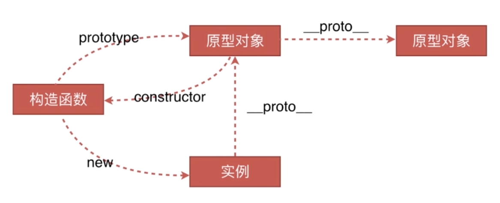
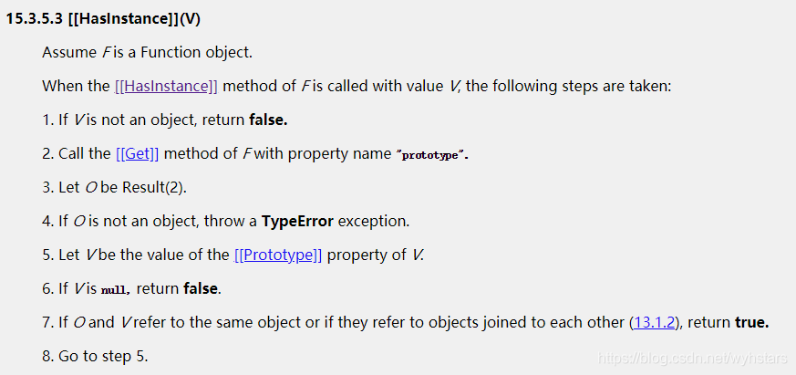

# 原型链
### 一、创建对象的几种方式
1. 通过字面量创建
```javascript
var obj1 = {name: 'obj1'};
obj1.__proto__ === Object.prototype // true
obj1.constructor === Object         // true
```
2. 通过 new Object 创建
```JavaScript
var obj2 = new Object({name: 'obj2'});
obj2.__proto__ === Object.prototype // true
obj2.constructor === Object         // true
```
3. 通过函数创建
```javascript
var M = function(name) {
  this.name = name;
}
var obj3 = new M('obj3');
obj3.__proto__ === M.prototype   // true
obj3.constructor === M           // true
M.prototype.constructor === M    // true 
```
4. 通过 Object.create 创建
```javascript
var p = {name: 'p'};
var obj4 = Object.create(p);
obj4.__proto__ === p;   // true
obj4.name === 'p';      // true
```
---
### 二、原型、构造函数、实例、原型链
- 构造函数、原型对象、实例间的关系图    

由上图可以得知：
  - 构造函数.prototype.constructor === 构造函数
  - 构造函数.prototype === 实例对象.\_\_proto\_\_
---
### 三、 instanceof 与 typeof 的区别以及 instanceof 的原理
1. typeof 判断数据类型
  - 基本数据类型(null、undefined、number、string、boolean，symbol)除了null，都会返回正确的数据类型。null 会返回 object。
  - 对象类型，对于函数会返回 function， 其他的都返回 object  
  - ！补充：可以通过 $\color{#6CF}{Object.prototype.toString.call(xx)}$ 来判断变量的正确类型，它会返回类似 $\color{#6CF}{[object}$ $\color{#6CF}{Type]}$ 的字符串。

2. 为什么要使用 instanceof ?   
可以看出 typeof 对于对象类型的数据类型的判断存在着局限，因此考虑使用 instanceof 来进行类型判断。

3. intanceof 的实现原理
  - instanceof 是通过原型链来实现继承关系的判断。
  - 从 ECMA 标准中可以得到：instanceof 实际上是调用了 JS 内部函数 $\color{#6CF}{[[HasInstance]]}$
  - 对于 $\color{#6CF}{[[HasInstance]]}$ ，在 ES6 中 Symbol章节中有如下解释：
    - 对象的 $\color{#6CF}{Symbol.hasInstance}$ 属性，指向一个内部的方法。当对象调用 instanceof 运算符，判断是否为该对象的实例时，会调用这个方法。
    - 比如， $\color{#6CF}{foo}$ $\color{#6CF}{instanceof}$ $\color{#6CF}{Foo}$ 在语言内部实际上是调用了 $\color{#6CF}{Foo[Symbol.hasInstance](foo)}$ 。
    - 下面是 ECMA 对于 $\color{#6CF}{[[HasInstance]]}$ 的描述：

4. 通过上面的描述，手写 instanceof 
```javascript
function instance_of(L, R){   // L 表示 instanceof 左边， R 表示 instanceof 右边
  if(typeof L !== 'object') return false; // 左边不是一个对象直接返回 false

  let O = R.prototype;
  // 判断 O 是否是对象，不是就抛出一个 TypeError 的错误
  if(typeof O !== 'object') throw Error('TypeError');
  L = L.__proto__;
  while(true){
    if(L === null) return false;
    if(O === L) return true;

    L = L.__proto__;
  } 
}
```

5. instanceof 的局限性
  - 不能判断基本数据类型，只能判断两个对象之间的关系
  - 对于 $\color{#6CF}{String}$ $\color{#6CF}{instanceof}$ $\color{#6CF}{String}$ 以及  $\color{#6CF}{Number}$ $\color{#6CF}{instanceof}$ $\color{#6CF}{Number}$ 等来说都会返回 false
```javascript
function Foo(name) {
  this.name = name;
}
var a = 1;
a instanceof Number;       // false
String instanceof String;  // false
Number instanceof Number;  // false
Foo instanceof Foo;  // false
```
  - 分析：
    - 首先 ECMA 规范中指出 instanceof 是来判断 object 类型的，如果不是就返回 false
    - 然后就是 Number 和 String 都是构造函数，原型链上是由 Function 实例化而来的。
    - 我们通过分析 Foo 就能得出原因：
```javascript
let O = R.prototype = Foo.prototype
L = L.__proto__ = Foo.__proto__ = Function.prototype

O !== L // 循环
L = L.__proto__ = Function.prototype.__proto__ = Object.prototype

O !== L // 循环
L = L.__proto__ = Object.prototype.__proto__ = null

return false
```
--- 
### 四、 new 关键字
new 关键字会进行如下操作: [手写new](new的实现.html)
1. 创建一个空的简单的 JavaScript 对象（即 {}）；
2. 链接该对象（设置该对象的 constructor）到另一个对象；
3. 将步骤1新创建的对象作为 this 的上下文；
4. 如果该函数没有返回对象，则返回 this
  
一个🌰：
当 new Foo(...) 执行时，会发生以下事情：
1. 一个继承自 Foo.prototype 的对象被创建。
2. 使用指定的参数调用构造函数 Foo，并将 this 绑定到新创建的对象。new Foo 等价于 new Foo()，也就是没有指定参数列表，构造函数 Foo 不带任何参数调用的情况。
3. 由构造函数返回的对象就是 new 的结果。如果构造函数没有显示的返回一个对象，则使用步骤1中创建的对象。（一般情况下，构造函数不返回值，但是用户可以选择主动返回对象，来覆盖正常的对象创建步骤）。