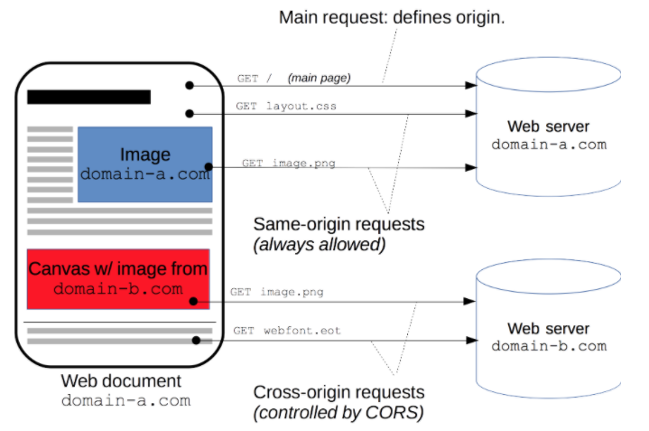

# 前端跨域
## 一、什么是跨域？
- 广义上的跨域是指一个域下的文档或脚本试图去请求另一个域下的资源：
    1. 资源跳转：a 链接、重定向、表单提交
    2. 资源嵌入：\<link\> \<script\> \ \<frame\> 等标签，还有样式中 background:url() @font-face() 等文件外部链接
    3. 脚本请求：JavaScript 发起的 ajax请求、DOM 和 js对象的跨域操作
- 狭义的跨域：值浏览器同源策略限制的请求。
- 注意：**并不是所有广义的跨域操作都不被允许，只有被同源策略限制的跨域操作不被允许**
---
## 二、什么是同源策略？
- 同源策略 SOP ( $\color{#6cf}{Same}$ $\color{#6cf}{origin}$ $\color{#6cf}{policy}$ ) 是浏览器为了安全考虑不允许访问不同域下的资源。
- 注意：
   1. 同源策略知识浏览器的安全策略，不是 http 协议的内容。 
   2. 对于向不同域发起的请求，浏览器会照常发出，服务器端处理后也会正常返回结果，但是结果会在返回后被浏览器拦截。 
- 浏览器判断同源的标准：
   - 请求协议相同
   - 请求域名相同 （域名与对应的 IP 不是同源）
   - 端口号相同
- 同源策略限制哪些内容：
   1. cookie、LocalStorage、IndexDB等**存储信息**无法读取
   2. DOM 对象无法获取
   3. Ajax 请求无法完成

---
## 三、处理跨域的方法
1. [jsonp 跨域](./js/jsonp跨域.html)
   - 原理：使用 \<script\> 可以跨域加载资源。浏览器端定义回调方法处理返回数据，跨域请求参数带回调用方法名；服务器需要知道返回方法名定义的方法，参数为需要的数据，这样浏览器接收以后直接以数据为参数调用回调方法。
   - 优点：没有兼容性的问题
   - 缺点：只支持 GET 请求
2. [postMessage 跨域](./js/postMessage.js) 
   -  $\color{#6cf}{postMessage}$ 是 HTML5 XMLHttpRequest Level 2 中的 API，且是为数不多的可以跨域操作 window 属性之一，它可以用于解决以下问题：
      1. 页面与其打开的新窗口之间的数据传递
      2. 多窗口之间的数据传递
      3. 页面与嵌套的 iframe 之间的消息传递
      4. 上面三种场景的跨域的数据传递
   -  使用方法：postMessage(data, origin) 方法接受两个参数
      -  data：html5 规范支持任意基本类型或者可以复制的对象，但是部分浏览器只支持字符串，所以传参最好使用 $\color{#6cf}{JSON.parse()}$ 序列化。
      -  origin：协议+主机+端口号，也可以设置为 “ * ”，表示可以传递给任意窗口，如果要指定和当前窗口同源的话设置为 “ / ”。
3. [CORS](./js/CORS)
   - 跨域资源共享 CORS ( $\color{#6cf}{Cross-origin}$  $\color{#6cf}{resource}$ $\color{#6cf}{ sharing}$ ) 是一种机制，该机制使用附加的 HTTP 头来告诉浏览器，准许运行在一个源上的 Web 应用访问另一个不同源选定的资源。
   - 
   - 过程：
     1. CORS 在浏览器端代码没有任何区别，浏览器识别到跨域请求后自动对其进行处理，用户没有感知。
     2. 服务端处理后，在响应头部添加 $\color{#6cf}{Access-Control-Allow-Origin}$ ，指定允许请求的源
     3. 浏览器收到响应后根据 Access-Control-Allow-Origin 判断本站点是否在允许范围内，允许则接收数据继续后续操作
   - 注意:
     - 普通跨域请求：只需要服务端设置  Access-Control-Allow-Origin 即可，前端无须设置
     - 需要携带 cookie： 前后端均需要设置（见 CORS 文件夹中的 js 文件）
   - 优点：基本满足 http 所有 Method 类型，也可以指定部分支持 Method
   - 缺点：兼容性不如 jsonp （IE10以上支持）
4. [WebSocket 协议跨域](./js/WebSocket)
    -  $\color{#6cf}{WebSockets}$协议 是一种应用层协议（与 HTTP 同层），基于 TCP 协议，实现了浏览器与服务器 全双工通信，同时允许跨域通信。
    - WebSocket 在建立时需要借助 http，但是连接之后双方通信过程与 http 协议无关，通过 WebSocket 与跨域服务器建立连接，就可以完成跨域请求。
    - 优点：协议自定义，减少数据内容
    - 缺点：
       1. 主要适用于双向通信的场景，否则长连接会有一定的内存消耗。
       2. 兼容性 IE10 以上，不过目前有 Socket.io 可以使用，兼容低版本。
5. [nginx 代理跨域](./js/nginx.js)
6. [documnet.domain + iframe 跨域](./js/documnet.domain.html)
   - 原理：两个页面都通过 js 设置 document.domain 为基础主域，就实现同域。
   - 限制：此方案仅限于主域相同，子域不同的跨域应用场景
7. [location.hash + iframe](./js/location.hash.js)
8. [window.name + iframe 跨域](./js/window.name.js)
9. [node.js 中间件代理跨域](./js/node.js)