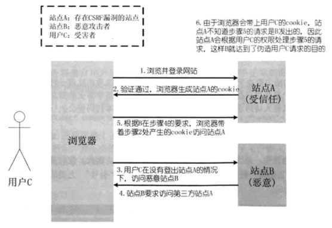

# CSRF
## 一、CSRF简介
- CSRF ( $\color{#6cf}{Cross-site}$ $\color{#6cf}{request}$ $\color{#6cf}{forgery}$ ) 攻击的全称是跨站请求伪造攻击，是一种对网站的恶意使用。   
- 与 XSS 的区别：XSS 利用的是站点内的信任用户，而 CSRF 则是通过伪装来自信任用户的请求利用受信任的网站。
- 可以这样理解 CSRF 攻击：攻击者盗用了你的身份，以你的名义向第三方网站发送恶意请求。
---
## 二、CSRF 攻击原理
<div align="center"></div>

1. 首先用户C浏览并登陆了受信任站点A；
2. 登录信息验证通过后，站点A会在返回给浏览器的信息中带上已登录的 cookie，cookie 信息会在浏览器端保存一段时间（根据服务端设置而定）；
3. 完成这一步之后，用户在没有登出站点A（清除站点A的cookie）的情况下，访问恶意站点B；
4. 这是恶意站点B的某个页面向站点A发起请求，而这个请求会带上保存在浏览器段的站点A的 cookie；
5. 站点A根据请求所携带的 cookie，判断此请求为用户C所发送的。
6. 因此站点A会根据用户C的权限来处理恶意站点C所发起的请求，而这个请求可能以可能以用户C的身份发送邮件、短信、消息，以及进行转账支付等操作，这样恶意站点B就达到了伪造用户C请求站点A的目的。
---
## 三、攻击举例
1. 假设某银行网站A以GET请求来发起转账操作，转账的地址为 `www.xxx.com\transfer.do?accountNum=10001&money=10000` ,参数 accountNum 表示转账的账户，参数 money 表示转账的金额。
2. 某大型论坛B上，一个恶意用户上传了一张图片，而图片的地址栏中填写的并不是图片的地址，而是前面所说的转账地址： `` ；
3. 当你登录网站A时，你的浏览器保存了银行A生成的 cookie，而当你访问论坛B的时候，页面上的 \ 需要浏览器发起一个新的 HTTP 请求，以获取图片资源；
4. 当浏览器发起请求的时候，请求的却是银行A的转账地址 `www.xxx.com\transfer.do?accountNum=10001&money=10000` ，并且会带上银行A的 cookie 信息；
5. 结果银行收到这个请求之后，会以为是你发起的一次转账操作，你的账户里就少了10000块钱。
6. 假设银行将其转账方式改为 POST 提交，而论坛C恰好又存在一个 XSS 漏洞，恶意用户在它的页面上植入以下代码：
```html
<form id="aaa" action="http://www.xxx.com/transfer.do" method="POST" display="none">
  <input type="text" name="accountNum" value="10001"/>
  <input type="text" name="money" value="10000"/>
</form>
<script>
  var form = documnet.forms('aaa');
  form.submit();
</script>
```
7. 如果你此时恰好登录了银行A，且没有登出，当你打开上述页面后，脚本会将表单aaa提交，把accountNum和money参数传递给银行的转账地址 `http://www.xxx.com/transfer.do` ，同样的，银行以为是你发起的一次转账会从你的账户中扣除10000块。
---
## 四、CSRF 的防御
1. 令牌同步模式
   - 令牌同步模式 STP（$\color{#6cf}{Synchronizer}$ $\color{#6cf}{token}$ $\color{#6cf}{pattern}$）
   - 原理：
     - 当用户发送请求时，服务器端应用将令牌（token，一个保密且唯一的值）嵌入 form 表格，并发送给客户端。
     - 客户端提交 form 表格时候，会将令牌发送到服务端，令牌的验证是由服务端实行的。
     - 令牌可以通过任何方式生成，只要确保随机性和唯一性。这样确保攻击者发送请求时候，由于没有该令牌而无法通过验证。
   - 缺点：STP能很好在 HTML 下运行，但导致的是服务端的复杂度升高，复杂度源于令牌的生成和验证。因为令牌是唯一且随机，如果每个表格都使用一个唯一的令牌，那么当页面过多时，服务器由于生产令牌而导致的负担也会增加。
2. 检查 Referer 字段
   - HTTP头中有一个 $\color{#6cf}{Referer}$ 字段，这个字段用以标明请求来源于哪个地址。
   - 在处理敏感数据请求时，通常来说，Referer字段应和请求的地址位于同一域名下。
   - 以上述银行操作为🌰：
     - Referer 字段地址通常应该是转账按钮所在的网页地址，应该也位于 `www.xxx.com` 之下。
     - 而如果是CSRF攻击传来的请求，Referer 字段会是包含恶意网址的地址，不会位于 `www.xxx.com` 之下，这时候服务器就能识别出恶意的访问。
   - 优点：这种办法简单易行，工作量低，仅需要在关键访问处增加一步校验。
   - 缺点：
     - 全依赖浏览器发送正确的 Referer 字段。虽然http协议对此字段的内容有明确的规定，但并无法保证来访的浏览器的具体实现，亦无法保证浏览器没有安全漏洞影响到此字段。
     - 也存在攻击者攻击某些浏览器，篡改其 Referer 字段的可能。
3. 添加校验token
   - **在请求中放入攻击者所不能伪造的信息，并且该信息不存在于cookie之中。** 这种信息通常是窗体中的一个数据项。服务器将其生成并附加在窗体中，其内容是一个伪随机数。
   - 当客户端通过窗体提交请求时，这个伪随机数也一并提交上去以供校验：
     - 正常的访问时，客户端浏览器能够正确得到并传回这个伪随机数
     - 通过CSRF传来的欺骗性攻击中，攻击者无从事先得知这个伪随机数的值，服务端就会因为校验 token 的值为空或者错误，拒绝这个可疑请求。