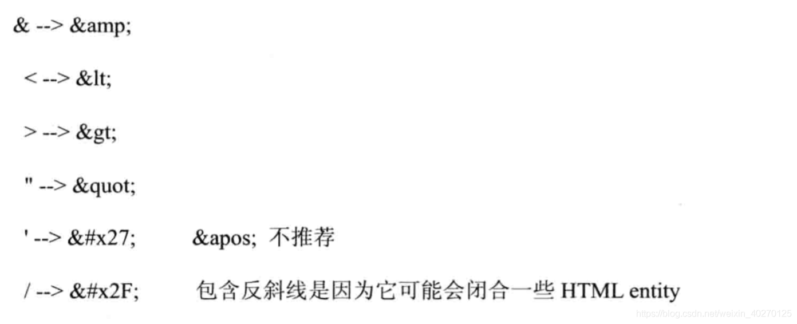

# XSS
## 一、XSS 攻击简介
- 跨站脚本攻击 ( $\color{#6cf}{Cross}$ $\color{#6cf}{Site}$ $\color{#6cf}{Scripting}$ ) 缩写为 CSS，为了与层叠样式表的缩写混淆，因此称为 XSS。
- 跨站脚本攻击，能够使得攻击者嵌入恶意脚本代码到正常用户能访问到的页面中，当正常用户访问该页面时，则可以导致嵌入的恶意脚本代码的执行，从而达到恶意攻击用户的目的。
--- 
## 二、攻击原理
向 Web 页面中插入恶意 Script 代码，来获取用户的信息，如 cookie，发送到攻击者自己的网站。

--- 
## 三、防御措施
XSS 预防的总体思路：**对输入（和 URL 参数）进行过滤，对输出进行编码**    
1. 通过设置 HTTP 头部 Set-Cookie 的 HttpOnly 属性。   
   - `Set-Cookie: name=value; HttpOnly`  
   - 这样设置以后，就无法在 XSS 攻击中使用 JavaScript 来获取用户的 cookie 了。
2. 输入检查
   - 输入检查，很多时候也被用于格式检查。🌰：
     - 用户在网站注册填写的用户名，会被要求只能是字母、数字等的组合。比如 “hello1234” 是一个合法的用户名，而“hello#$^”就是一个非法的用户名。
   - 输入检查的逻辑，必须放在服务器端代码中来实现。如果只在客户端中使用 JavaScript 来进行输入检查，很容易被攻击者绕过，目前 Web 开发的普遍做法，是是同时在客户端 JavaScript 中和服务器代码中实现相同的输入检查。客户端 JavaScript 的输入检查，可以阻挡大部分误操作的正常用户，从而节约服务器资源。
   - 在XSS的防御上，输入检查一般是检查用户输入的数据中是否包含一些特殊字符，如<、>、'、“等，如果发现存在特殊字符，将这些特殊字符过滤或者编码。
3. 输出检查
